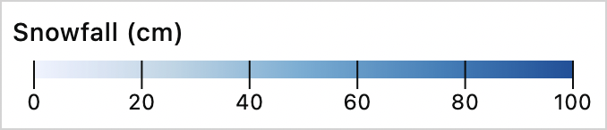

# Color Legend Element



```html
<color-legend></color-legend>
```

A [Custom Element](https://developer.mozilla.org/en-US/docs/Web/Web_Components/Using_custom_elements) suitable for use as a legend in data visualizations. Built with [Lit/Lit-Element](https://lit.dev/) and [D3JS](https://d3js.org/).

## Features

- Render legends for continuous, discrete, and categorical data.
- Uses `d3-scale`'s concept of a `domain` and a `range` for mapping values to visual marks.
- Compatable with color interpolators from `d3-scale-chromatic`
- Customizable via its [properties / attributes](#properties) and [CSS variables](#css-variables).
- Framework and bundler not required, just add a `<script>` tag and use it!
- [Small bundle size](https://bundlephobia.com/package/color-legend-element) (28kb minified and 9kb gzipped)

## Installation

**NOTE: the `<color-legend>` assumes D3JS is available as a dependency.** At the very least this should include the following modules from the D3JS library: `d3-scale`, `d3-array`, `d3-format`, `d3-interpolate`, and `d3-scale-chromatic` (if using one of d3's color scheme interpolators).

Install via [npm](https://www.npmjs.com/package/color-legend-element):

```bash
npm install color-legend-element
```

You may then `import` the `<color-legend>` in the desired ES Module:

```js
import "color-legend-element";
```

To use without a frontend build tool, add the `<color-legend>` via a `<script>` tag in your HTML document.

```html
<script
  type="module"
  src="color-legend-element/build/color-legend-element.js"
></script>
```

If you prefer to not use the ESM build, you may instead use the UMD build:

```html
<script src="color-legend-element/build/color-legend-element.umd.js"></script>
```

## Example Usage

The `<color-legend>` will render using its default settings as follows:

```html
<color-legend></color-legend>
```

It may be customized by settings its properties and CSS variables (full list below).

See [the color-legend website](https://clhenrick.github.io/color-legend-element) for more examples of how to use the Color Legend Element.

## Properties

The following table lists the Color Legend Element's properties and attributes. See [the color-legend website](https://clhenrick.github.io/color-legend-element) for examples of how these properties may be configured to render various types of legends. All properties listed have a corresponding HTML attribute of the same name except for the `interpolator` property which may only be set as a property using JavaScript.

| Property     | Type             | Default Value          | Description                                                           | Has Attribute |
| ------------ | ---------------- | ---------------------- | --------------------------------------------------------------------- | ------------- |
| titleText    | string           | "Color Legend Element" | The title text that displays at the top of the legend.                | Yes           |
| width        | number           | 325                    | The width of the SVG or categorical legend div element.               | Yes           |
| height       | number           | 32                     | The height of the SVG element.                                        | Yes           |
| marginTop    | number           | 6                      | The spacing between the legend bar and top most extent of the SVG.    | Yes           |
| marginRight  | number           | 12                     | The spacing between the legend bar and right most extent of the SVG.  | Yes           |
| marginBottom | number           | 16                     | The spacing between the legend bar and bottom most extent of the SVG. | Yes           |
| marginLeft   | number           | 12                     | The spacing between the legend bar and left most extent of the SVG.   | Yes           |
| scaleType    | ScaleType        | "continuous"           | The type of legend to render based on d3-scale.                       | Yes           |
| domain       | number\|string[] | [0, 1]                 | The color scale's domain values.                                      | Yes           |
| range        | string[]         | d3.schemeYlGnBu[5]     | The color scale's range values.                                       | Yes           |
| markType     | MarkType         | "circle"               | The symbology used for categorical legends.                           | Yes           |
| ticks        | number           | 5                      | The desired number of axis ticks.                                     | Yes           |
| tickFormat   | string           | ".1f"                  | The d3-format specifier to format axis tick values.                   | Yes           |
| tickSize     | number           | 6                      | The size or length of the axis ticks.                                 | Yes           |
| tickValues   | number[]         | null                   | The explicit values to be used for axis ticks.                        | Yes           |
| interpolator | Interpolator     | null                   | The color interpolator function.                                      | No            |

Note: see [types](./src/types.ts) for enum types such as `ScaleType`, `MarkType`, and `Interpolator`.

## CSS Variables

The internal styling (CSS) of the Color Legend Element may be altered via the following [CSS variables / custom properties](https://developer.mozilla.org/en-US/docs/Web/CSS/Using_CSS_custom_properties):

| Custom Property            | Default Value          | Description                                                             |
| -------------------------- | ---------------------- | ----------------------------------------------------------------------- |
| --cle-font-family          | sans-serif             | Font used for tick and legend item text                                 |
| --cle-font-family-title    | var(--cle-font-family) | Font used for the legend's title text                                   |
| --cle-font-size            | 0.75rem                | Font size for the tick and legend item text                             |
| --cle-font-size-title      | 0.875rem               | Font size for the legend title text                                     |
| --cle-letter-spacing       | 0.3px                  | Letter spacing for tick and legend item text                            |
| --cle-letter-spacing-title | 0.25px                 | Letter spacing for the legend title text                                |
| --cle-font-weight          | 400                    | Font weight for the tick and legend item text                           |
| --cle-font-weight-title    | 500                    | Font weight for the title text                                          |
| --cle-color                | currentColor           | Font color for all text and tick lines                                  |
| --cle-background           | #fff                   | Background color for the legend                                         |
| --cle-padding              | 0.375rem               | Padding in the legend's container div                                   |
| --cle-border               | none                   | Border style of the legend's container div                              |
| --cle-border-radius        | 0                      | Border radius of the legend's container div                             |
| --cle-box-sizing           | content-box            | Box-sizing property of the legend's container div                       |
| --cle-columns              | 2                      | Number of columns for categorical legends                               |
| --cle-column-width         | auto                   | Column width for categorical legends                                    |
| --cle-item-margin          | 0.375rem 0.75rem 0 0   | Margin property for categorical legend items                            |
| --cle-line-width           | 24px                   | Width of the "line" markType for categorical legends                    |
| --cle-line-height          | 2px                    | Height of the "line" markType for categorical legends                   |
| --cle-swatch-size          | 10px                   | Height & Width of "rect" and "circle" markTypes for categorical legends |
| --cle-swatch-width         | var(--cle-swatch-size) | Width of the "rect" and "circle" markTypes for categorical legends      |
| --cle-swatch-height        | var(--cle-swatch-size) | Height of the "rect" and "circle" markTypes for categorical legends     |
| --cle-swatch-margin        | 0 0.5rem 0 0           | Margin of the mark (line, square, circle) for categorical legends       |

The following example demonstrates how to override the default values of the `<color-legend>`'s CSS variables:

```css
color-legend {
  --cle-font-family: serif;
  --cle-font-family-title: Impact;
  --cle-letter-spacing-title: 0.5px;
  --cle-color: white;
  --cle-background: #222;
  --cle-border-radius: 6px;
  --cle-padding: 0.25rem 0.25rem 0.75rem;
}
```

## Local Development

Requires Node.js v16.13.0 and NPM >=8.

In the root of this repository first install dependencies:

```bash
npm install
```

### Building from src

All compiled files will be outputted in the `build/` directory.

To create the ESM build:

```bash
npm run build
```

or to watch for changes:

```bash
npm run build:watch
```

To create both the ESM & UMD bundles:

```bash
npm run bundle
```

### Develop

To view the `<color-legend>` without bundling it:

```
npm run serve
```

or

```
npm run serve:prod
```

This will start up a local web server for `dev/index.html`. You may then modify the contents of `src/` and/or `dev/index.html` and inspect the changes in your browser.

### Running tests

Tests are located in [`src/test`](./src/test) and may be run in either a development or production environment via:

```
npm run test:dev
```

or:

```
npm run test:prod
```

To run tests in both a development and a production environment do:

```
npm run test
```

To have the tests run when making changes to `src/`:

```
npm run test:watch
```

or

```
npm run test:prod:watch
```

### Building the docs

To generate the `docs` directory:

```bash
npm run docs
```

This will first remove the `docs/` directory, build files from the `src/`, and build files from the `docs-src/` directory into the `docs/` directory. All necessary files will be copied into `docs/` directory (e.g. from `build/` and `node_modules/`) in order for the `<color-legend>` render as it would in a production environment.

To serve the docs directory and watch for changes:

```bash
npm run docs:serve
```

Then open your browser to `localhost:8080` to view the site.

### Updating the custom-elements.json

According to [Open Web Components](https://github.com/open-wc/custom-elements-manifest#custom-elements-manifest):

> Custom Elements Manifest is a file format that describes custom elements. This format will allow tooling and IDEs to give rich information about the custom elements in a given project.

To update the `custom-elements.json` manifest:

```bash
npm run analyze
```

## License

Licensed under the MIT License, Copyright 2021 Chris L Henrick.

## Credits

🙏 Some project boilerplate has been borrowed from the [Lit Element TypeScript Starter Kit](https://github.com/lit/lit-element-starter-ts) under the BSD-3-Clause License, Copyright 2017 Google LLC.

🙏 Inspired by the [Color Legend](https://observablehq.com/@d3/color-legend) on [Observable](https://observablehq.com) by [Mike Bostock](https://observablehq.com/@mbostock) under the ISC License, Copyright 2019–2020 Observable, Inc.
